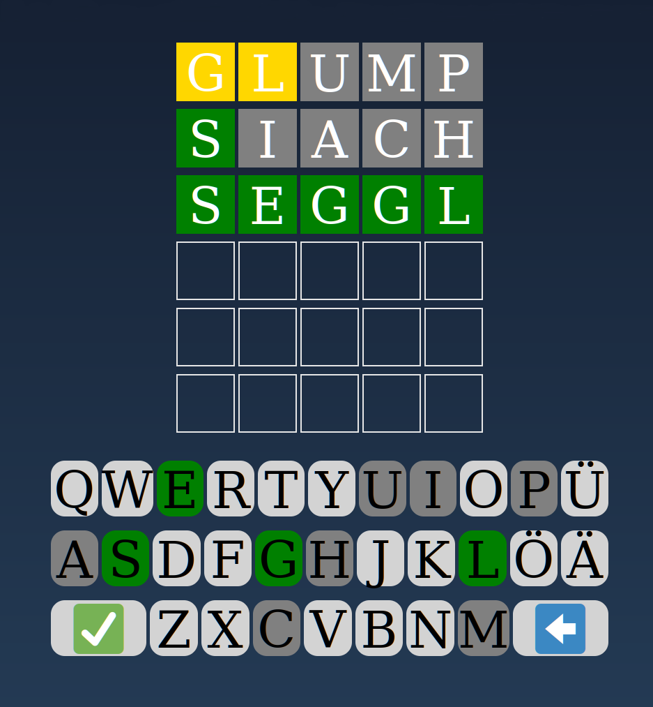

# Wörtle

### Wordle fia Schwobn

I'm sorry. It had to be done. Live version at [https://floe.github.io/woertle/](https://floe.github.io/woertle/).

Hat tip to [WolfsHollow](https://github.com/WolfsHollow) for creating a 
[Wordle clone](https://github.com/WolfsHollow/WordMaster) that doesn't require me to install NPM and one gazillion packages,
run everything through 17 preprocessing steps, and load some dozens of external resources. The JavaScript ecosystem is so fucked up.

Also many thanks to Peter-Michael Mangold for [Schwäbisch Schwätza](https://www.schwaebisch-schwaetza.de/) where I got the wordlist from.
